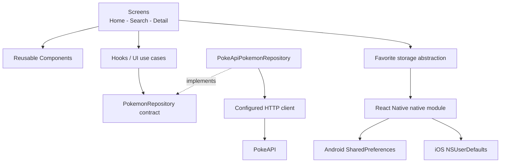
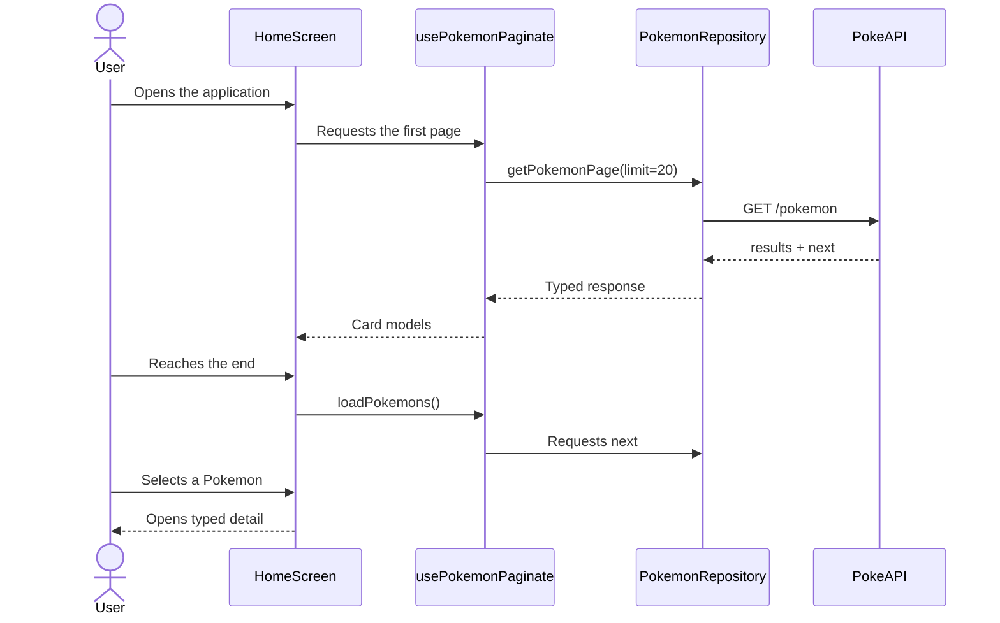
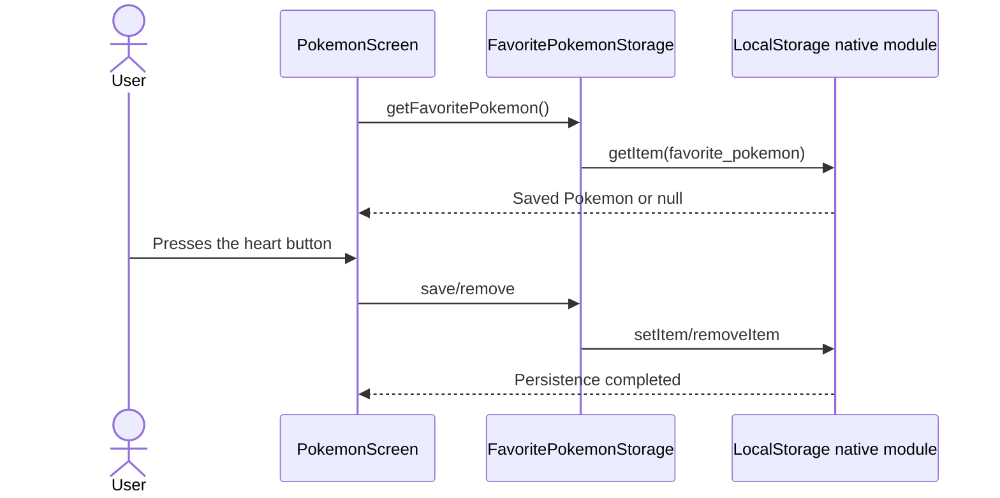
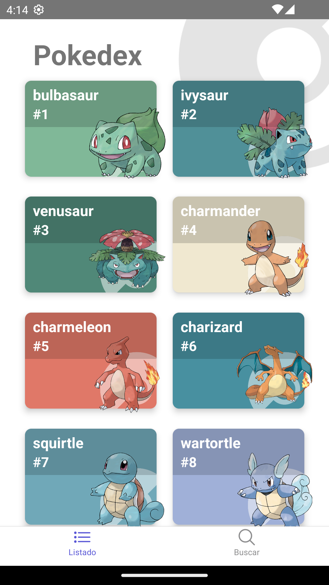
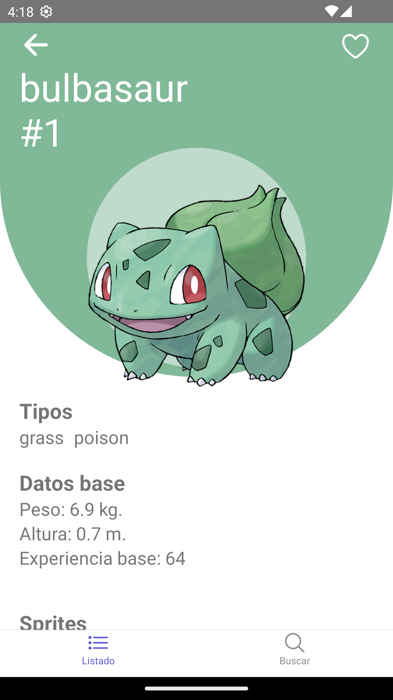

<p align="center">
  
</p>

<p align="center">
  <a href="README.md">Español</a> | <strong>English</strong>
</p>

<h1 align="center">Pokedex React Native</h1>

<p align="center">
  Mobile application for exploring Pokemon, viewing their data, and saving a favorite.
</p>

<p align="center">
  
  
  
  
  
</p>

---

## Contents

- [Overview](#overview)
- [Assessment coverage](#assessment-coverage)
- [Features](#features)
- [Architecture](#architecture)
- [Project structure](#project-structure)
- [Main flows](#main-flows)
- [Persistence](#persistence)
- [Performance](#performance)
- [Installation](#installation)
- [Running the app](#running-the-app)
- [Testing and quality](#testing-and-quality)
- [Libraries](#libraries)
- [Evidence](#evidence)
- [Trade-offs and improvements](#trade-offs-and-improvements)

## Overview

Pokedex built with React Native CLI and TypeScript. It consumes the public
[PokeAPI](https://pokeapi.co/) to display a paginated list, search for Pokemon
by name or number, and navigate to a detailed information screen.

The application includes loading, error, retry, and empty states. Users can
also save one favorite Pokemon, which is persisted locally between sessions.

## Assessment coverage

| Requirement | Implementation | Status |
| --- | --- | --- |
| First 20 Pokemon | Initial request with `limit=20` | Complete |
| Name and image | Cards with name, number, and official artwork | Complete |
| Navigation | Typed stacks from the list and search screens | Complete |
| Detail screen | Types, abilities, stats, weight, height, experience, sprites, and moves | Complete |
| Visual states | Loading, error, retry, and empty data | Complete |
| Decoupled API access | Hooks, repository contract, and PokeAPI implementation | Complete |
| Local persistence | `SharedPreferences` on Android and `NSUserDefaults` on iOS | Complete |
| TypeScript | Typed models, routes, responses, and dependencies | Complete |
| Documentation | Setup, architecture, decisions, evidence, and pending work | Complete |
| Bonus | Pagination, search, cache, accessibility, linting, and tests | Complete |

## Features

- Initial load of 20 Pokemon.
- Incremental pagination when the list reaches its end.
- Debounced search by name or number.
- Typed navigation to the detail screen.
- Types, weight, height, base experience, sprites, abilities, moves, and stats.
- Persistent favorite through the heart button.
- In-memory detail cache for the current session.
- Friendly messages and retry actions.
- Accessibility labels on actions and cards.

## Architecture

The solution uses a pragmatic separation inspired by Clean Architecture.
Screens do not perform HTTP requests or access native APIs directly. Hooks
coordinate each use case and depend on the `PokemonRepository` contract rather
than Axios or PokeAPI.



### Responsibilities

| Layer | Responsibility |
| --- | --- |
| Screens | Compose the interface and connect navigation with state |
| Components | Render reusable cards, details, search, and visual states |
| Hooks | Coordinate pagination, search, caching, loading, and errors |
| Repository | Define the data contract and isolate PokeAPI |
| API | Configure the base URL, timeout, and HTTP client |
| Storage | Expose persistence without coupling the UI to Android or iOS |
| Utils | Transform external responses into simple UI models |

The repository dependency can be replaced when using the hooks. This improves
testability and allows the data source to change without modifying screens.

## Project structure

```text
Pokedex-update/
|
|-- App.tsx                         # Main navigation container
|-- README.md                       # Spanish documentation
|-- README.en.md                    # English documentation
|-- package.json                    # Scripts and dependencies
|-- __tests__/                      # App, mapper, and storage tests
|-- __mocks__/                      # Jest doubles for external modules
|-- docs/screenshots/               # Android visual evidence
|
|-- src/
|   |-- api/                        # Configured PokeAPI client
|   |-- components/                 # Reusable visual components
|   |-- hooks/                      # UI use cases and state
|   |-- interfaces/                 # TypeScript models and contracts
|   |-- navigator/                  # Stacks, tabs, and route types
|   |-- repositories/               # PokeAPI contract and adapter
|   |-- screens/                    # List, search, and detail screens
|   |-- storage/                    # Local persistence abstraction
|   |-- theme/                      # Shared styles
|   |-- utils/                      # Pure data mappers
|   `-- assets/                     # Application images
|
|-- android/
|   `-- app/src/main/java/com/pokedex/
|       |-- LocalStorageModule.java # SharedPreferences bridge
|       `-- LocalStoragePackage.java
|
`-- ios/Pokedex/
    `-- LocalStorage.m              # NSUserDefaults bridge
```

## Main flows

### List, pagination, and detail



### Local favorite



## Persistence

React Native 0.70 does not include AsyncStorage in core. To avoid another
dependency, the project implements a small native module and a shared
TypeScript abstraction:

- Android uses `SharedPreferences`.
- iOS uses `NSUserDefaults`.
- The persisted key is `favorite_pokemon`.
- Stored content is validated when read; invalid data is removed safely.
- Jest uses in-memory storage so tests can run without a native bridge.

This strategy provides partial offline availability: the favorite remains
available without a network connection. Previously fetched details stay cached
for the duration of the current session.

## Performance

- Pagination loads blocks of 20 instead of the full catalog at startup.
- `FlatList` keeps virtualization enabled with reduced rendering windows and batches.
- `PokemonCard` is memoized so existing cards do not render again when a page is appended.
- `renderItem` keeps a stable reference through `useCallback`.
- Native fade animation is reserved for details; cards avoid accumulating
  hundreds of animation callbacks during fast scrolling.
- Color extraction only runs when a visible card mounts.
- Search results are calculated with `useMemo`, while input uses debounce.
- Fetched details remain cached for the current session.
- Only 24 moves are displayed to keep the detail screen readable and lightweight.

## Installation

### Requirements

- Node.js 20 (verified with 20.19.5).
- npm.
- Android Studio and Android SDK for Android.
- Xcode and CocoaPods for iOS.

```bash
git clone git@github.com:hugohasm/pokedex.git
cd pokedex/Pokedex-update
npm install
```

To prepare iOS:

```bash
cd ios
pod install
cd ..
```

## Running the app

Start Metro:

```bash
npm start
```

In another terminal, run the desired platform:

```bash
npm run android
npm run ios
```

## Testing and quality

```bash
npm run typecheck
npm run lint
npm test -- --runInBand --watchman=false
```

Included coverage:

- Basic rendering of the application and navigators.
- PokeAPI ID extraction and response mapping.
- Favorite save, read, and removal operations.
- ESLint and TypeScript configuration with no errors.

## Libraries

| Library | Rationale |
| --- | --- |
| React Navigation | Tab and stack navigation with typed routes |
| Axios | HTTP client with base URL, timeout, and typed responses |
| React Native Vector Icons | Consistent icons for navigation and actions |
| React Native Image Colors | Card color derived from official artwork |
| Safe Area Context | Safe-area handling across Android and iOS |
| React Native Screens | Native integration and navigation performance |
| Gesture Handler | Gestures required by navigation and ScrollView |

The assessment contains two conflicting directions: one section requests no
external libraries, while another allows justified library choices. This app
started from an existing codebase with the libraries listed above. No new
dependencies were introduced for persistence, architecture, states,
performance, or testing.

## Evidence

Screenshots captured on Android 13 using a Pixel 2 API 33 emulator:

<p align="center">
  
  
</p>

## Trade-offs and improvements

- Add focused unit tests for data hooks.
- Add skeleton loaders as an optional visual enhancement.
- Persist the list and detail cache to expand offline support.
- Centralize messages by HTTP or connectivity error type.
- Upgrade React Native and the native toolchain in a dedicated iteration.

---

<p align="center">
  Project prepared as a React Native technical assessment.
</p>
