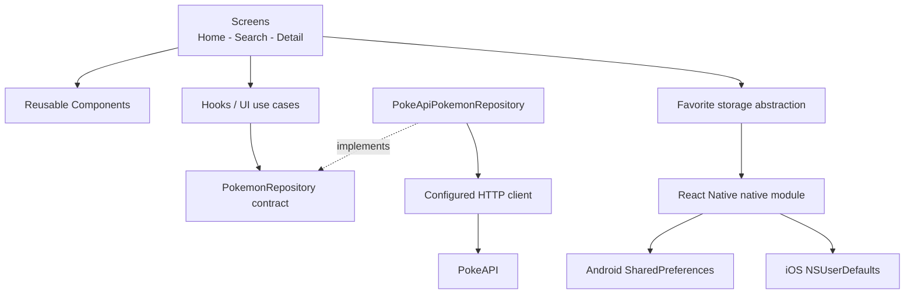
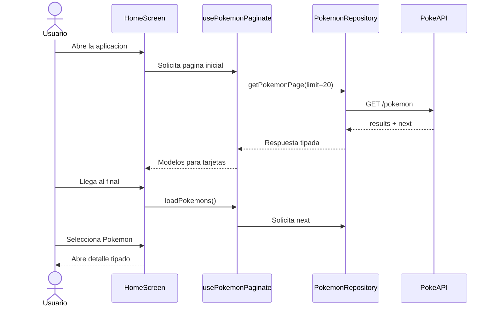
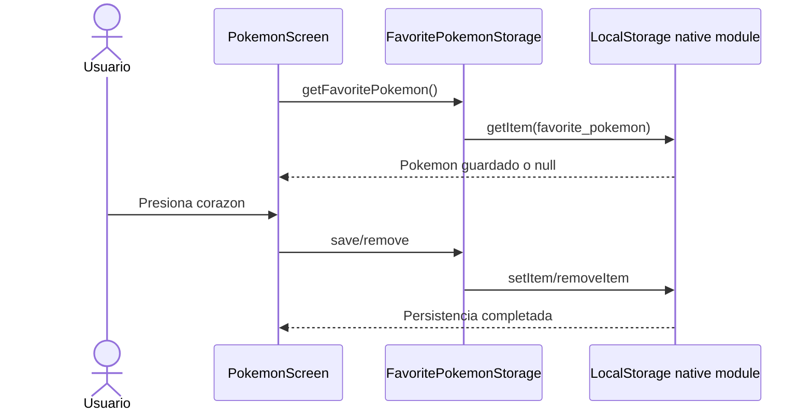

<p align="center">
  
</p>

<h1 align="center">Pokedex React Native</h1>

<p align="center">
  Aplicacion movil para explorar Pokemon, consultar sus datos y guardar un favorito.
</p>

<p align="center">
  
  
  
  
  
</p>

---

## Contenido

- [Descripcion](#descripcion)
- [Cobertura del assessment](#cobertura-del-assessment)
- [Funcionalidad](#funcionalidad)
- [Arquitectura](#arquitectura)
- [Estructura del proyecto](#estructura-del-proyecto)
- [Flujos principales](#flujos-principales)
- [Persistencia](#persistencia)
- [Rendimiento](#rendimiento)
- [Instalacion](#instalacion)
- [Ejecucion](#ejecucion)
- [Pruebas y calidad](#pruebas-y-calidad)
- [Librerias](#librerias)
- [Evidencia](#evidencia)
- [Trade-offs y mejoras](#trade-offs-y-mejoras)

## Descripcion

Pokedex desarrollada con React Native CLI y TypeScript. Consume la API publica
[PokeAPI](https://pokeapi.co/) para presentar un listado paginado, buscar Pokemon
por nombre o numero y navegar a una vista con informacion detallada.

La aplicacion incluye estados de carga, error, reintento y contenido vacio. El
usuario tambien puede guardar un Pokemon favorito, conservado localmente entre
sesiones.

## Cobertura del assessment

| Requisito | Implementacion | Estado |
| --- | --- | --- |
| Primeros 20 Pokemon | Consulta inicial con `limit=20` | Completo |
| Nombre e imagen | Tarjetas con nombre, numero e imagen oficial | Completo |
| Navegacion | Stacks tipados desde listado y busqueda | Completo |
| Pantalla de detalle | Tipos, habilidades, stats, peso, altura, experiencia, sprites y movimientos | Completo |
| Estados visuales | Carga, error, reintento y datos vacios | Completo |
| Consumo desacoplado | Hooks, contrato de repositorio e implementacion de PokeAPI | Completo |
| Persistencia local | `SharedPreferences` en Android y `NSUserDefaults` en iOS | Completo |
| TypeScript | Modelos, rutas, respuestas y dependencias tipadas | Completo |
| Documentacion | Instalacion, arquitectura, decisiones, evidencia y pendientes | Completo |
| Bonus | Paginacion, busqueda, cache, accesibilidad, lint y tests | Completo |

## Funcionalidad

- Carga inicial de 20 Pokemon.
- Paginacion incremental al llegar al final del listado.
- Busqueda con debounce por nombre o numero.
- Navegacion tipada a la pantalla de detalle.
- Tipos, peso, altura, experiencia base, sprites, habilidades, movimientos y
  estadisticas.
- Favorito persistente desde el boton de corazon.
- Cache de detalles durante la sesion.
- Mensajes amigables y acciones de reintento.
- Etiquetas de accesibilidad en acciones y tarjetas.

## Arquitectura

La solucion aplica una separacion pragmatica inspirada en Clean Architecture.
Las pantallas no realizan peticiones HTTP ni acceden directamente a APIs nativas.
Los hooks coordinan cada caso de uso y dependen del contrato
`PokemonRepository`, no de Axios ni de PokeAPI.



### Responsabilidades

| Capa | Responsabilidad |
| --- | --- |
| Screens | Componer la interfaz y conectar navegacion con estado |
| Components | Renderizar tarjetas, detalle, busqueda y estados reutilizables |
| Hooks | Coordinar paginacion, busqueda, cache, carga y errores |
| Repository | Definir el contrato de datos y aislar PokeAPI |
| API | Configurar URL base, timeout y cliente HTTP |
| Storage | Exponer persistencia sin acoplar la UI a Android o iOS |
| Utils | Transformar respuestas externas en modelos simples de UI |

La dependencia del repositorio se puede sustituir al usar los hooks, lo que
facilita pruebas y permite cambiar la fuente de datos sin modificar pantallas.

## Estructura del proyecto

```text
Pokedex-update/
|
|-- App.tsx                         # Contenedor principal de navegacion
|-- README.md                       # Documentacion de la entrega
|-- package.json                    # Scripts y dependencias
|-- __tests__/                      # Pruebas de aplicacion, mappers y storage
|-- __mocks__/                      # Dobles de Jest para modulos externos
|-- docs/screenshots/               # Evidencia visual Android
|
|-- src/
|   |-- api/                        # Cliente configurado para PokeAPI
|   |-- components/                 # Componentes visuales reutilizables
|   |-- hooks/                      # Casos de uso y estado de UI
|   |-- interfaces/                 # Modelos y contratos TypeScript
|   |-- navigator/                  # Stacks, tabs y tipos de rutas
|   |-- repositories/               # Contrato y adaptador de PokeAPI
|   |-- screens/                    # Listado, busqueda y detalle
|   |-- storage/                    # Abstraccion de persistencia local
|   |-- theme/                      # Estilos compartidos
|   |-- utils/                      # Mappers puros de datos
|   `-- assets/                     # Imagenes de la aplicacion
|
|-- android/
|   `-- app/src/main/java/com/pokedex/
|       |-- LocalStorageModule.java # Bridge hacia SharedPreferences
|       `-- LocalStoragePackage.java
|
`-- ios/Pokedex/
    `-- LocalStorage.m              # Bridge hacia NSUserDefaults
```

## Flujos principales

### Listado, paginacion y detalle



### Favorito local



## Persistencia

React Native 0.70 no incluye AsyncStorage en el core. Para no agregar una
dependencia adicional se implemento un modulo nativo pequeno y una abstraccion
TypeScript comun:

- Android utiliza `SharedPreferences`.
- iOS utiliza `NSUserDefaults`.
- La clave persistida es `favorite_pokemon`.
- El contenido se valida al leerlo; un valor invalido se elimina de forma segura.
- En Jest existe un almacenamiento en memoria para ejecutar pruebas sin bridge.

La estrategia ofrece disponibilidad offline parcial: el favorito permanece sin
conexion. Los detalles consultados se mantienen en cache durante la sesion.

## Rendimiento

- Paginacion en bloques de 20 para evitar cargar todo el catalogo al iniciar.
- `FlatList` conserva la virtualizacion con ventana y lotes de render reducidos.
- `PokemonCard` esta memoizado para que las tarjetas existentes no se rendericen
  de nuevo al agregar una pagina.
- `renderItem` mantiene una referencia estable con `useCallback`.
- El fade nativo se reserva para el detalle; las tarjetas evitan acumular cientos
  de callbacks de animacion durante scroll rapido.
- La extraccion de color solo ocurre al montar una tarjeta visible.
- La busqueda calcula resultados con `useMemo` y aplica debounce al texto.
- Los detalles consultados se almacenan en cache durante la sesion.
- Solo se muestran 24 movimientos para mantener el detalle legible y ligero.

## Instalacion

### Requisitos

- Node.js 20 (verificado con 20.19.5).
- npm.
- Android Studio y Android SDK para Android.
- Xcode y CocoaPods para iOS.

```bash
git clone git@github.com:hugohasm/pokedex.git
cd pokedex/Pokedex-update
npm install
```

Para preparar iOS:

```bash
cd ios
pod install
cd ..
```

## Ejecucion

Iniciar Metro:

```bash
npm start
```

En otra terminal, ejecutar la plataforma deseada:

```bash
npm run android
npm run ios
```

## Pruebas y calidad

```bash
npm run typecheck
npm run lint
npm test -- --runInBand --watchman=false
```

Cobertura incluida:

- Renderizado basico de la aplicacion y navegadores.
- Extraccion de ID y transformacion de respuestas de PokeAPI.
- Guardado, lectura y eliminacion del favorito.
- Configuracion de ESLint y TypeScript sin errores.

## Librerias

| Libreria | Justificacion |
| --- | --- |
| React Navigation | Navegacion mediante tabs y stacks con rutas tipadas |
| Axios | Cliente HTTP con URL base, timeout y respuestas tipadas |
| React Native Vector Icons | Iconos consistentes para navegacion y acciones |
| React Native Image Colors | Color de tarjeta derivado de la imagen oficial |
| Safe Area Context | Respeto de areas seguras en Android y iOS |
| React Native Screens | Integracion nativa y rendimiento de navegacion |
| Gesture Handler | Gestos requeridos por la navegacion y ScrollView |

El assessment contiene dos indicaciones en tension: una seccion solicita no usar
librerias externas y otra permite seleccionarlas si se justifican. Esta aplicacion
partio de una base existente con las librerias anteriores. No se agregaron nuevas
dependencias para persistencia, arquitectura, estados, rendimiento ni pruebas.

## Evidencia

Capturas obtenidas en Android 13, emulador Pixel 2 API 33:

<p align="center">
  
  
</p>

## Trade-offs y mejoras

- Agregar pruebas unitarias especificas para los hooks de datos.
- Incorporar skeleton loaders como mejora visual opcional.
- Persistir el cache de listado y detalle para ampliar el modo offline.
- Centralizar mensajes por tipo de error HTTP o conectividad.
- Actualizar React Native y el toolchain nativo en una iteracion dedicada.

---

<p align="center">
  Proyecto preparado como assessment tecnico de React Native.
</p>
